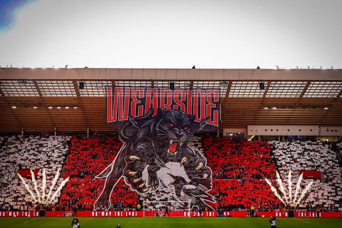

# Sunderland Premier League Prediction 2026-27

Sunderland are a newly promoted team to the Premier League for 2025-26 so they only have one season of Premier League data.  
This project investigates whether a team's performance in one Premier League season can help predict what happens in the next.

The prediction will be tracked throughout the 2026-27 season and compared with actual match results.  
As a Sunderland fan I really hope some of these predictions are wrong... 

## How it works

1. **Estimate team strength** — rate each team's attack and defence using 2025–26 data.
2. **Predict goals** — estimate how many goals each side is expected to score in 2026–27 fixtures.
3. **Simulate the season** — run 10,000 simulations to estimate win, draw and loss probabilities, along with a possible points total.
4. **Track performance** — compare the forecast with real results as the season progresses.

## Things to note:

- Rather than waiting until the end of the season, I’ll update the tracker as matches are played and compare the actual results with the model's predictions.

- Second seasons can be difficult to forecast. Newly promoted teams may change significantly, opponents have more recent 
information about them, and Sunderland also face the additional demands of European fixtures. These factors make the season 
a useful test of how well a simple data-driven model performs in practice.

- Football is inherently unpredictable, and a team plays only 38 league matches in a season. A small number of results 
will not prove a model right or wrong; the aim is to evaluate how its predictions perform across the season.

##  Premier League 2026-27 Fixture Predictions 

| # | Date | Opponent          | H/A | Predicted result | Actual result | Predicted score | Actual score | Result correct (NOT SCORE)? |
|---|------|-------------------|-----|------------------|---------------|-----------------|--------------|----------------------------|
| 1 | 22 Aug | Ipswich Town      | A | L                | L             | 0 - 1           | 1 - 2        | Yes                        |
| 2 | 29 Aug | Fulham            | H | W                | W             | 1 - 0           | 1 - 0        | Yes                        |
| 3 | 5 Sep | Brentford         | A | L                | D             | 1 - 2           | 1 - 1        | No                         |
| 4 | 12 Sep | Arsenal           | H | L                | L             | 0 - 1           | 0 - 2        | Yes                        |
| 5 | 19 Sep | Manchester City   | A | L                | L             | 0 - 2           | 3 - 5        | Yes                        |
| 6 | 10 Oct | Brighton          | H | L                | L             | 0 - 1           | 0 - 2        | Yes                        |
|7  | 17 Oct | Bournemouth       | A | L                |               |                 |              |                            |
| 8 | 24 Oct | Leeds             | H | L                |               |                 |              |                            |
| 9 | 31 Oct | Coventry City     | A | L                |               |                 |              |                            |
| 10 | 7 Nov | Chelsea           | H | L                |               |                 |              |                            |
| 11 | 21 Nov | Aston Villa       | A | L                |               |                 |              |                            |
| 12 | 28 Nov | Tottenham         | H | W                |               |                 |              |                            |
| 13 | 2 Dec | Liverpool         | A | L                |               |                 |              |                            |
| 14 | 5 Dec | Newcastle United  | A | L                |               |                 |              |                            |
| 15 | 12 Dec | Nottingham Forest | H | W                |               |                 |              |                            |
| 16 | 19 Dec | Crystal Palace    | H | L                |               |                 |              |                            |
| 17 | 26 Dec | Everton           | A | L                |               |                 |              |                            |
| 18 | 30 Dec | Manchester United | A | L                |               |                 |              |                            |
| 19 | 2 Jan | Hull City         | H | W                |               |                 |              |                            |
| 20 | 6 Jan | Liverpool         | H | L                |               |                 |              |                            |
| 21 | 16 Jan | Chelsea           | A | L                |               |                 |              |                            |
| 22 | 23 Jan | Coventry City     | H | W                |               |                 |              |                            |
| 23 | 30 Jan | Tottenham         | A | L                |               |                 |              |                            |
| 24 | 6 Feb | Aston Villa       | H | L                |               |                 |              |                            |
| 25 | TBC | Hull City         | A | L                |               |                 |              |                            |
| 26 | TBC | Everton           | H | W                |               |                 |              |                            |
| 27 | 27 Feb | Crystal Palace    | A | L                |               |                 |              |                            |
| 28 | TBC | Manchester United | H | L                |               |                 |              |                            |
| 29 | TBC | Brentford         | H | L                |               |                 |              |                            |
| 30 | TBC | Ipswich Town      | H | W                |               |                 |              |                            |
| 31 | TBC | Bournemouth       | H | L                |               |                 |              |                            |
| 32 | TBC | Fulham            | A | L                |               |                 |              |
| 33 | TBC | Arsenal           | H | L                |               |                 |              |                            |
| 34 | TBC | Brighton          | H | L                |               |                 |              |                            |
| 35 | TBC | Leeds             | H | L                |               |                 |              |                            |
| 36 | TBC | Nottingham Forest | H | L                |               |                 |              |                            |
| 37 | TBC | Newcastle United  | A | L                |               |                 |              |